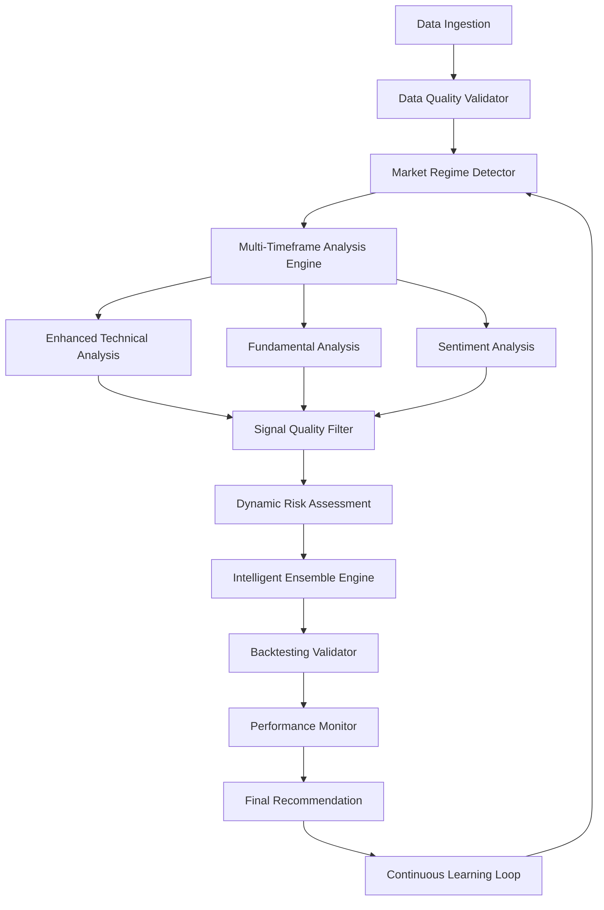

# Stock Bot Accuracy Improvements - Design Document

## Overview

This design document outlines a comprehensive approach to significantly improve the accuracy and reliability of the stock trading bot. The improvements focus on enhancing signal quality, implementing sophisticated risk management, adding robust backtesting validation, and creating intelligent ensemble decision-making systems. The design maintains backward compatibility while introducing advanced features that adapt to changing market conditions.

## Architecture

### High-Level Architecture Changes



### Core Components Enhancement

1. **Enhanced Signal Processing Pipeline**
   - Multi-stage signal filtering and validation
   - Dynamic parameter adjustment based on market conditions
   - Historical performance tracking for each indicator

2. **Intelligent Risk Management System**
   - Real-time volatility regime detection
   - Dynamic position sizing using Kelly Criterion variants
   - Portfolio-level risk monitoring and adjustment

3. **Advanced Backtesting Framework**
   - Walk-forward analysis with multiple validation windows
   - Monte Carlo simulation for robustness testing
   - Statistical significance testing for strategy validation

4. **Adaptive Ensemble Decision Engine**
   - Machine learning-based signal weighting
   - Conflict resolution algorithms
   - Confidence-based recommendation generation

## Components and Interfaces

### 1. Enhanced Technical Analysis Engine

**File:** `agents/enhanced_technical_analysis.py`

```python
class EnhancedTechnicalAnalysisEngine:
    def __init__(self):
        self.signal_quality_filter = SignalQualityFilter()
        self.regime_detector = MarketRegimeDetector()
        self.performance_tracker = IndicatorPerformanceTracker()
        
    def analyze_with_quality_control(self, df: pd.DataFrame, symbol: str) -> Dict[str, Any]:
        # Multi-timeframe analysis with quality filtering
        pass
        
    def get_dynamic_weights(self, market_regime: str, volatility: float) -> Dict[str, float]:
        # Dynamic indicator weighting based on conditions
        pass
```

**Key Features:**
- Signal quality scoring and filtering
- Multi-timeframe consistency checks
- Dynamic parameter adjustment
- Performance-based indicator weighting

### 2. Advanced Risk Assessment Module

**File:** `agents/advanced_risk_assessment.py`

```python
class AdvancedRiskAssessment:
    def __init__(self):
        self.volatility_estimator = GARCHVolatilityEstimator()
        self.correlation_monitor = DynamicCorrelationMonitor()
        self.kelly_calculator = EnhancedKellyCriterion()
        
    def calculate_optimal_position_size(self, symbol: str, signal_strength: float, 
                                      portfolio_state: Dict) -> float:
        # Kelly Criterion with volatility and correlation adjustments
        pass
        
    def assess_portfolio_risk(self, positions: Dict, market_data: Dict) -> Dict[str, float]:
        # Real-time portfolio risk metrics
        pass
```

**Key Features:**
- GARCH-based volatility forecasting
- Dynamic correlation monitoring
- Kelly Criterion with risk adjustments
- Real-time portfolio risk assessment

### 3. Robust Backtesting Framework

**File:** `simulation/advanced_backtesting_engine.py`

```python
class AdvancedBacktestingEngine:
    def __init__(self):
        self.walk_forward_analyzer = WalkForwardAnalyzer()
        self.monte_carlo_simulator = MonteCarloSimulator()
        self.statistical_validator = StatisticalValidator()
        
    def run_comprehensive_backtest(self, strategy: BaseStrategy, 
                                 data: Dict[str, pd.DataFrame]) -> BacktestResults:
        # Comprehensive backtesting with multiple validation methods
        pass
        
    def validate_statistical_significance(self, results: BacktestResults) -> ValidationReport:
        # Statistical significance testing
        pass
```

**Key Features:**
- Walk-forward analysis
- Monte Carlo robustness testing
- Statistical significance validation
- Out-of-sample performance verification

### 4. Intelligent Ensemble Decision Engine

**File:** `recommendation/intelligent_ensemble.py`

```python
class IntelligentEnsembleEngine:
    def __init__(self):
        self.signal_combiner = AdaptiveSignalCombiner()
        self.conflict_resolver = SignalConflictResolver()
        self.confidence_estimator = BayesianConfidenceEstimator()
        
    def generate_ensemble_recommendation(self, signals: List[Signal], 
                                       market_context: MarketContext) -> Recommendation:
        # Intelligent signal combination with confidence estimation
        pass
        
    def resolve_signal_conflicts(self, conflicting_signals: List[Signal]) -> Signal:
        # Sophisticated conflict resolution
        pass
```

**Key Features:**
- Bayesian confidence estimation
- Adaptive signal weighting
- Sophisticated conflict resolution
- Market context awareness

### 5. Market Regime Detection System

**File:** `agents/market_regime_detector.py`

```python
class MarketRegimeDetector:
    def __init__(self):
        self.hmm_model = HiddenMarkovModel(n_states=4)
        self.volatility_classifier = VolatilityRegimeClassifier()
        self.trend_detector = TrendRegimeDetector()
        
    def detect_current_regime(self, market_data: pd.DataFrame) -> MarketRegime:
        # Multi-factor regime detection
        pass
        
    def get_regime_specific_parameters(self, regime: MarketRegime) -> Dict[str, Any]:
        # Parameter adjustments for different regimes
        pass
```
