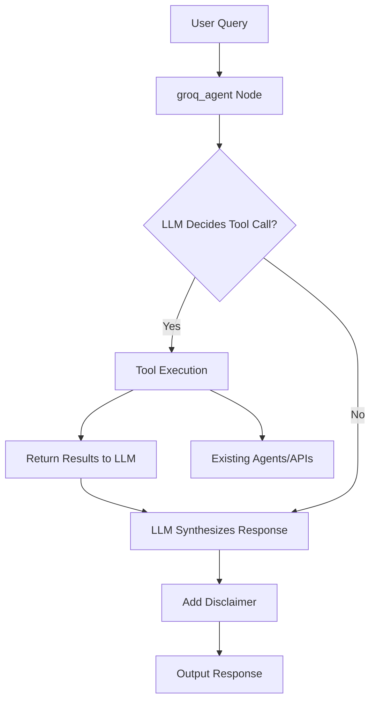

# Groq Tool-Calling Integration Architecture for StockBot

## Overview

This document outlines the high-level architecture for integrating Groq API tool-calling into the existing stock_bot_langgraph project, transforming it into StockBot, an interactive AI assistant for Indian stock market analysis. The integration enables dynamic, tool-augmented responses to user queries, leveraging free APIs and maintaining modularity.

## Key Decisions

- **Tool-Calling Framework**: Use Groq's OpenAI-compatible tool-calling with LangGraph's create_react_agent for agent orchestration.
- **Indian Stocks Focus**: Enforce .NS symbols; reject non-Indian with warnings.
- **Free APIs**: yfinance for prices, existing sentiment/news APIs; no paid services.
- **Modularity**: Reuse existing agents (data_fetcher, technical_analysis, etc.) for tool execution.
- **Safety**: Mandatory disclaimers in all responses; rate-limiting for APIs.
- **Interface**: Shift from CLI batch to interactive console loop; optional Streamlit/Gradio later.

## Component Interactions

- **groq_agent Node**: Central node using ChatGroq with bound tools.
- **Tools**: fetch_stock_price, compute_technical_indicators, get_sentiment, validate_indian_stock.
- **Existing Agents**: Called by tool execution functions.
- **Data Flow**: Query -> LLM -> Tool Call -> Execution -> Response Synthesis -> Disclaimer.

## Architecture Diagram

## File Changes Needed

- **tools.py** (new): Tool definitions and execution functions.
- **main.py**: Add groq_agent node, update build_workflow_graph with conditional routing, add interactive mode.
- **config/config.py**: Add GROQ_TOOL_CHOICE, MAX_TOOL_CALLS, DISCLAIMER_TEXT.
- **tests/**: Add tool mocks and integration tests.

## Addressing Review Gaps

- **No Groq Tool Calls**: Now enabled via tools.
- **Static CLI**: Interactive mode added.
- **No Disclaimers**: Mandatory in responses.
- **Non-Indian Handling**: validate_indian_stock tool enforces.
- **Modularity**: Maintained by reusing agents.

This design ensures StockBot is interactive, safe, and focused on Indian stocks using free APIs.