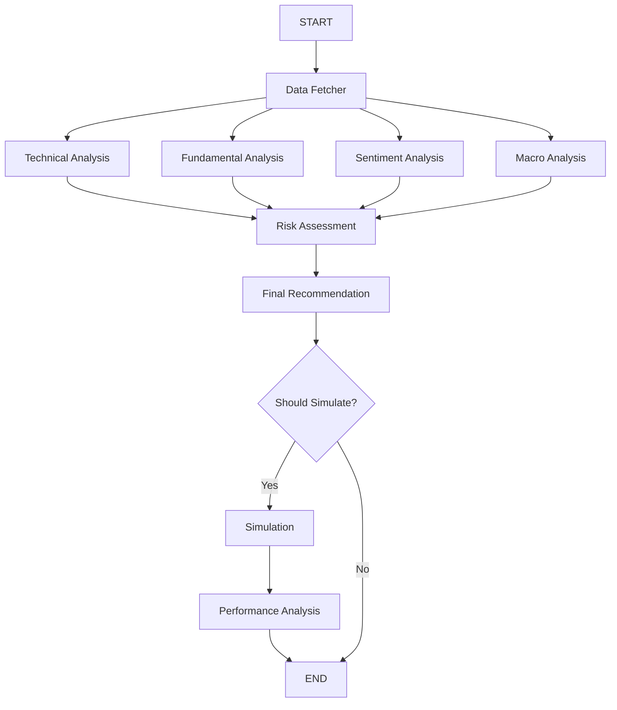

# Stock Trading Bot Codebase Analysis Plan

## Project Overview
The stock trading bot is a Python-based system using LangGraph for workflow orchestration. It analyzes Indian stocks (NSE focus) via free APIs, generates recommendations, and simulates trades. Key: Modular agents, backtesting, dashboard. No frontend beyond FastAPI UI. Uses uv for env management.

## Key Components
- **Core (main.py)**: LangGraph workflow: data → analysis → recommend → simulate.
- **Config**: API keys, thresholds (RSI=35/65), NIFTY_50 list.
- **Data**: Fetch (Yahoo, Alpha Vantage), clean/validate, real-time streaming.
- **Agents**: Technical (RSI/MACD/HMM/LSTM), fundamental/sentiment/risk/macro.
- **Recommendation**: Weighted synthesis (technical 30%), LLM reasoning.
- **Simulation**: Backtesting with slippage/commission; strategies (trend, reversion).
- **Utils**: Error handling, logging, scraping.
- **Dashboard**: FastAPI with auth/WebSocket.

## Mermaid Workflow Diagram

## Todo List
1. **Verify Execution**: Run `uv run main.py --ticker RELIANCE.NS` to test workflow (confirm no errors, check output).
2. **Test Multi-Stock**: Execute `uv run main.py --tickers RELIANCE.NS,TCS.NS` for ranking (validate top buy candidate).
3. **Run Backtest**: Use `uv run main.py --nifty50 --backtest` to simulate NIFTY 50 (check metrics like Sharpe/win rate).
4. **Inspect Data Flow**: Read data/apis.py and data/ingest.py to ensure free API priority and Indian stock handling.
5. **Review Advanced Features**: Examine agents/technical_analysis.py for HMM/LSTM (run test_hmm.py via `uv run test_hmm.py`).
6. **Check Dashboard**: Start `uv run dashboard/app.py` and test /api endpoints (verify real-time updates).
7. **Assess Dependencies**: Confirm pyproject.toml (no paid deps); test `uv venv --python=3.12` and `uv sync`.
8. **Document Enhancements**: Note gaps (e.g., add tests); suggest containerization for deployment.

This plan ensures validation and identifies improvements. Ready for implementation?